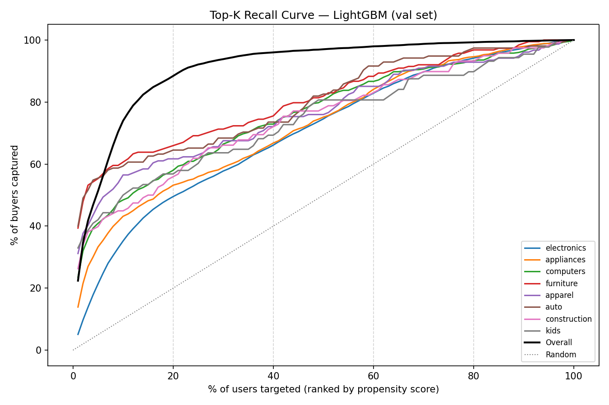

# Purchase Propensity

This project provides a model that predicts the probability that a user purchases from each product category in the next 5 days, given their browsing behavior over a month. Output is a probability score per (user, category)-pair, suitable for ranking users within a category for targeting, or for expected-value calculations.

**Dataset:** [REES46 eCommerce behavior data](https://www.kaggle.com/datasets/mkechinov/ecommerce-behavior-data-from-multi-category-store) — ~110M events across Oct–Nov 2019 (view / cart / purchase).

---

## Problem Setup

| | Window | Role |
|---|---|---|
| Features | Oct 1–31 2019 | Behavioral signal |
| Labels | Nov 1–5 2019 | Purchase targets |

Nov 1–5 is chosen as the stable period before Black Friday run-up (~22k purchases/day).

**Category scope:** Eight categories with ≥500 training positives are used: electronics, appliances, computers, furniture, apparel, auto, construction, kids. The remaining five categories are excluded from the scaffold but their October events still contribute to user-level features.

**Scaffold:** All (user, category)-pairs across the 8 categories, 80/20 user split — train 1.4M rows (3.22% positive), test 349K (3.24%).

**Features:** Six groups: recency (days since last view/cart/purchase per category), frequency (event counts at 7/14/30-day windows, category-specific and cross-category), engagement (active days, session count, category breadth), intent ratios (cart-to-view at 7d and 30d), price (avg viewed and carted price per category), and category base rate.

---

## Methodology

- **5-fold GroupKFold by user** — users repeat across (user, category)-rows; random k-folds would leak the same user across train and validation, inflating CV scores.
- **20% validation set held out before any fitting** — including before hyperparameter search and before computing any target-derived features (the category prior is computed from `train_pool` only). Measures generalization to fully unseen users.
- **HP search on fold 0 only; fold 0 excluded from the reported OOF AUC** — tuning on a fold and then reporting that fold inflates the number. The process turned out not to be critical: AUC across 20 trials varied by under 0.001.
- **LightGBM selected from {LightGBM, XGBoost, HistGradientBoosting}** — all three landed at val AUC ~0.9444–0.9445 with default hyperparameters; LightGBM was picked for speed.
- **Calibration evaluated on a held-out half of the val set** — fitting a calibrator on one set and evaluating it on the same set is circular. Isotonic regression slightly *worsened* log loss on the held-out half (0.0736 → 0.0739), so the final model uses raw LightGBM scores. The model is already well-calibrated in expectation (val mean prob 0.0320, true rate 0.0323).
- **Full-population scaffold over case-control sampling** — training LightGBM on a purchaser-only scaffold drops val AUC by 0.036 (logistic regression drops only 0.002), showing the gap is a training-data problem, not a model-capacity problem.
- **Reproducibility flags** — `n_jobs=1`, `deterministic=True`, `force_col_wise=True` for LightGBM, fixed `SEED=42` everywhere. Bit-exact across reruns.

---

## Results

| Model | OOF AUC | Val AUC | Val LogLoss |
|---|---|---|---|
| LightGBM (tuned) | 0.9465 | 0.9445 | 0.0743 |
| Logistic Regression | 0.9085 | 0.9069 | 0.0895 |
| Naive baseline (category rate) | 0.8694 | 0.8705 | 0.1061 |



**Key findings:**

- **Top 20% targeting captures ~70–80% of buyers:** Ranking users by propensity score and targeting the top 20% recovers roughly 70–80% of actual buyers across all categories — a 3.5–4× lift over random selection.
- **Price segment is the top signal:** `avg_price_viewed_30d` leads feature importance by a notable margin. It likely captures where a user sits in the price range of a category, which is strongly predictive of whether they'll buy there.
- **Cross-category activity outranks category-specific:** `total_views_30d`, `total_purchases_30d`, and `session_count_30d` rank above their category-specific counterparts — overall engagement level generalizes across categories.
- **Category-specific cart counts are among the weakest features** despite representing explicit purchase intent, possibly because short-window cart behavior is noisy at this dataset's scale.
- **Cold-start users would receive inflated predictions in production:** Users with no October activity (8.2% of val) have a positive rate of ~12.7%, roughly four times the overall val rate, and the model is well-calibrated for them on this dataset (AUC 0.9272). However, this is a training-data artifact: the scaffold was built from October-active users, so all zero-feature training examples were purchasers. A truly new user in production would receive ~12% predicted probability rather than the ~3% base rate. Production deployment would need either a cold-start fallback or a training scaffold that includes zero-feature negatives.

**Note on causality.** This is a propensity model (predicting who *will* buy), not an uplift model (predicting who will buy *because of* an intervention). It is designed for ranking and expected-value calculations; randomized experiments (A/B testing) are recommended to measure the impact of any marketing actions taken on these scores.

**Held-out test set.** The final model was evaluated once on the 20% held-out test users — never touched during model selection, HP search, calibration, the case-control experiment, or any other decision: **Test AUC 0.9466, Test LogLoss 0.0739, mean prob 0.0324 (true rate 0.0326).** Test AUC is 0.0021 *above* val (0.9445) with log loss 0.0004 lower, and the mean predicted probability matches the true test rate within 0.0002. The val-driven decisions did not over-fit val, and the model's calibration in expectation holds on a fresh held-out set.

---

## Getting Started

1. Download [2019-Oct.csv and 2019-Nov.csv](https://www.kaggle.com/datasets/mkechinov/ecommerce-behavior-data-from-multi-category-store) into `data/`
2. `uv sync` (or `pip install -e .` if not using uv)
3. `python main.py`

To resume from a specific step: `python main.py --from features` or `--from train`.

Alternatively, the notebooks are self-contained and cover the full exploratory analysis and modeling.

## Serving

After training, start the scoring API:

```bash
uvicorn serve:app --reload
```

Interactive docs at `http://localhost:8000/docs`.

**`POST /score`** — score a single (user, category) feature row:

```bash
curl -X POST http://localhost:8000/score \
  -H 'Content-Type: application/json' \
  -d '{
    "record_id": "user_42",
    "category_l1": "electronics",
    "views_30d": 20, "carts_30d": 3, "purchases_30d": 1,
    "views_14d": 10, "carts_14d": 2, "purchases_14d": 0,
    "views_7d": 4,  "carts_7d": 1,  "purchases_7d": 0,
    "days_since_view": 1, "days_since_cart": 3, "days_since_purchase": 25,
    "total_views_30d": 55, "total_carts_30d": 6, "total_purchases_30d": 2,
    "active_days_30d": 18, "category_breadth_30d": 4, "session_count_30d": 12,
    "brand_count_30d": 5, "avg_price_viewed_30d": 349.0, "avg_price_carted_30d": 299.0
  }'
```

```json
{"record_id": "user_42", "category_l1": "electronics", "propensity_score": 0.4817}
```

**`POST /score/batch`** — score across multiple categories at once; response is sorted by score descending, making it ready to use as a ranked target list. Each record follows the same schema as `/score`. The `cat_purchase_rate` and `cart_view_ratio` features are computed server-side and do not need to be supplied.

**Design note:** the API accepts precomputed features (one row per (user, category)-pair), not raw events. In a production system a feature computation layer would compute these aggregates from the events stream.

---

## Repo Structure

```
.
├── data/                        # gitignored
│   ├── 2019-Oct.csv             # download manually
│   ├── 2019-Nov.csv             # download manually
│   ├── events.parquet           # EDA notebook only (~3.5 GB)
│   ├── events_clean.parquet
│   ├── train_features.parquet
│   ├── test_features.parquet
│   └── test_predictions.parquet
├── figures/
├── models/
│   ├── lgb_model.pkl            # gitignored
│   └── model_info.json          # params, n_estimators, OOF/val metrics
├── notebooks/
│   ├── 01_eda.ipynb             # EDA & cleaning
│   ├── 02_features.ipynb        # Feature engineering
│   └── 03_modeling.ipynb        # Modeling, calibration, final predictions
├── output/
│   └── test_predictions_sample.csv  # top 5 per category; full CSV gitignored
├── src/
│   ├── config.py                # paths, dates, feature lists
│   ├── clean.py                 # CSVs → events_clean.parquet
│   ├── features.py              # events_clean → feature parquets
│   └── train.py                 # features → model, figures, test predictions
├── main.py                      # orchestrates full pipeline
├── serve.py                     # FastAPI scoring endpoint
├── pyproject.toml
├── uv.lock
└── README.md
```

---

## Stack

Python · Polars (EDA & feature engineering) · pandas · scikit-learn · LightGBM · XGBoost · FastAPI
